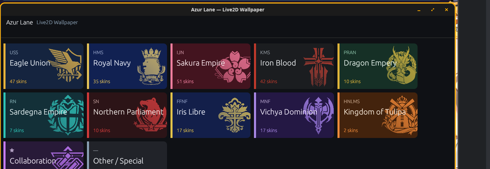

# Azur Lane — Live2D Wallpaper Picker

A DE-independent (COSMIC + Hyprland first) desktop GUI to browse the extracted Azur Lane
Live2D skins **by faction**, preview them, and apply any as an animated live wallpaper.
Faction-themed, two-level navigation. Built with Rust + egui.



## Run

```fish
# dev
cargo run
# release
cargo build --release && ./target/release/al-wallpaper
```
Also installed as an app-menu entry: **Azur Lane Wallpaper** (`~/.local/share/applications/al-wallpaper.desktop`).

## Use

- **Level 1** — grid of faction embl's; click a faction to enter its gallery (the whole UI reskins to that faction's palette).
- **Level 2** — themed gallery of that faction's skins (thumbnail + ship name + skin name; ⚭ = oath skin). Search box filters by ship/skin; a filter bar adds **★ Favorites** / **⚭ Oath** toggles and a **sort** (Ship A–Z / Skin A–Z), with a live "N shown" count. Click a card → detail panel.
- **Keyboard** — arrow keys move the gallery selection (highlighted card auto-scrolls into view), **Enter** opens it, **Esc** closes the detail panel / backs out to the faction grid, and **`/`** focuses the search box.
- **Detail** — preview + **Apply as wallpaper**: a button for **all monitors** plus one per monitor (apply a *different* skin to each output). The preview is an **animated loop** of the skin's idle motion (a small cached GIF rendered from the same Live2D pipeline; it plays once ready, falling back to a static native-aspect frame meanwhile — batch with `node scripts/preview_anim.js --all`). A progress modal shows the render % the first time a skin is used at a given resolution (then it's cached). `LIVE` badge + a per-monitor status line (bottom bar) show what's applied where.
- **Fit on screen** (detail panel) — choose **Fit** / **Stretch** / **Crop** per monitor and see a monitor-shaped preview of how the skin will sit on that output (pick which monitor from the dropdown). *Fit* shows the whole painting (contain), the gradient filling any letterbox/pillarbox bars; *Crop* covers the screen, cropping the edges; *Stretch* fills both axes (may distort). The modes only differ when the painting's native aspect differs from the monitor's — AL skins range from square (1:1) to 16:9 to 3:2, so a square painting on a 16:9/ultrawide screen shows a big Fit↔Crop difference, while a 16:9 painting on a 16:9 monitor looks the same in every mode (there's nothing to fit differently). The setting is per-monitor and persisted to `state.json`, so apply/rotation/autostart honor it. Each fit renders & caches once per resolution; change the fit, then re-apply to update a live monitor. The preview uses a native-aspect render of each painting (generated on first view; batch with `node scripts/preview.js --all`).
- **★ Favorites** — toggle a skin's favorite in the detail panel (★ badge shows on cards). Favoriting kicks off a background pre-render at your monitor resolutions, so favorites apply/rotate instantly. Seed the set with `node scripts/build_favorites.js`; pre-render them all with `bash scripts/prerender.sh --favorites`.
- **⟳ Auto-rotate** (header) — enable automatic rotation every 5m/15m/30m/1h/6h/daily/weekly/monthly, over a pool (**★ Favorites**, all skins, or one faction), optionally a different skin on each monitor; plus **Rotate now**. Runs via a tiny DE-independent poll daemon (`scripts/rotate-daemon.sh`), so it keeps rotating even when the app is closed. (Favorites pool = instant; other pools render fresh skins on first use.)
- **⏻ Power** (header) — animated wallpapers cost GPU, so by default mpvpaper **pauses the video when the wallpaper is hidden** (e.g. a fullscreen game/maximized window) and resumes instantly when revealed; choose **Keep playing** / **Pause** / **Stop** (stop = max saving, brief reload) and an optional **frame-rate cap** (15/24/30 fps). Also **Freeze the wallpaper while on battery** — a tiny DE-independent daemon (`scripts/power-daemon.sh`, started from autostart + on enable) SIGSTOPs mpvpaper whenever the laptop is unplugged and SIGCONTs it on AC (no-op on a desktop). Persisted to `state.json`; the hidden-pause/fps settings apply to wallpapers set from then on (re-apply to update what's already live), while battery freezing takes effect within ~30s.
- Launch hooks (handy for keybinds / a future rice): `AL_START_FACTION=iron_blood`, `AL_AUTOAPPLY=<skin>` (apply on launch), `AL_SELECT=<codename>`, `AL_SHOW_ROTATION=1`, `AL_SHOW_POWER=1`.

## How the data is built (`scripts/`)

| script | purpose |
|---|---|
| `build_catalog.js` | joins community game data → `data/catalog.json` (codename → ship, faction, skin name, oath). Source: [AzurLaneTools/AzurLaneData](https://github.com/AzurLaneTools/AzurLaneData) EN. Join: `ship_skin_template.painting` → `ship_group` → `ship_data_group.nationality` + `ship_data_statistics.name`; nationality int → faction via `data/sources/nationality_map.json`. |
| `thumb.js` | batch frame-0 thumbnailer (headless Chromium + pixi-live2d-display) → `assets/thumbs/<skin>.png` (3:4 gallery cards). |
| `preview.js` | renders each skin at its **native painting aspect** → `assets/preview/<skin>.png`, so the "fit on screen" preview matches reality. `--all` to batch; the GUI also generates these lazily on first view. |
| `preview_anim.js` | renders a short looping idle animation at native aspect → `assets/preview_anim/<skin>.gif` (the detail-panel animated preview). `--all` to batch; the GUI generates these lazily on first view. Needs `ffmpeg`. |
| `apply.sh` | portable apply: detect monitors (`wlr-randr`→`cosmic-randr`→`hyprctl`), render per-output (reuses `../wallpaper/render.js`), `mpvpaper` per output, write default. |

Regenerate the catalog after a game data update:
```fish
TODAY=$(date +%F) node scripts/build_catalog.js
```

## Dependencies

- Runtime: a `wlr-layer-shell` compositor (COSMIC, Hyprland, sway) + `mpvpaper`.
- Build/data: Rust, Node (puppeteer/ffmpeg for thumbs), the extracted Live2D models in `~/azurlane/extract/out_all/Live2DOutput`.

## Known limitations (v1)

- The detail preview is a pre-rendered looping GIF, not a live in-app Cubism engine (intentional, see `docs/PLAN.md`); the true live render is the applied wallpaper.
- 2 skins (`wuqi_3`/`wuqi_3_hx`, Azuma) don't render in the headless pipeline → shown with a placeholder.
- 11 skins fall into **Other / Special** (paintings newer than the community data dump, or META/Siren/Universal).

## Faction emblems

`assets/emblems/<faction>.png` — the authentic in-game faction insignia (eagle, crowned lion, sakura, iron cross, …), sourced from GitHub mirrors (`Fernando2603/AzurLane` nationality icons + `DCBuild-hcm` for Tulipa) and converted to white silhouettes so the app tints each to its faction accent color at runtime. Originals kept in `data/raw/emblems_orig/`.

See `docs/PLAN.md` for the full architecture and roadmap (incl. the future Hyprland rice hooks).
